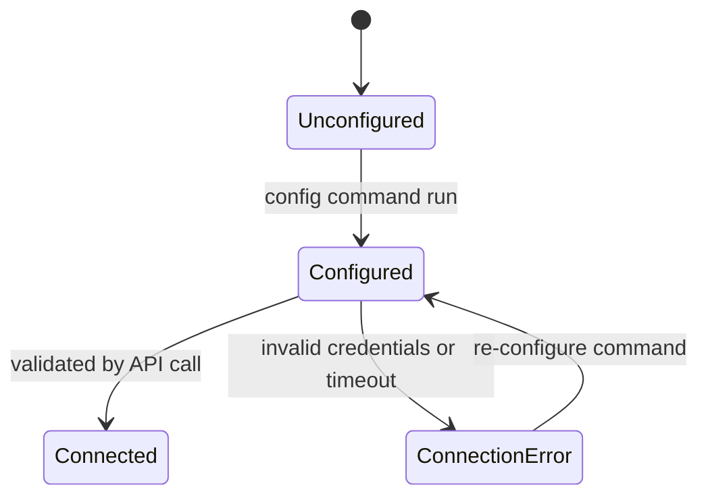

# Data Model: Remote Frappe CLI

This document outlines the local storage structure, internal entities, and data models used by the Remote Frappe CLI tool.

## 1. Local Configuration Model

Stored in `~/.frappe-cli.json` to persist the remote site connection parameters. Supports both legacy single-profile (automatically migrated on load) and modern multi-profile configurations.

### Schema:
```json
{
  "$schema": "http://json-schema.org/draft-07/schema#",
  "title": "FrappeCliConfig",
  "type": "object",
  "properties": {
    "default_profile": {
      "type": "string",
      "default": "default"
    },
    "profiles": {
      "type": "object",
      "additionalProperties": {
        "type": "object",
        "properties": {
          "site_url": {
            "type": "string",
            "format": "uri",
            "pattern": "^https?://"
          },
          "api_key": {
            "type": "string",
            "minLength": 1
          },
          "api_secret": {
            "type": "string",
            "minLength": 1
          },
          "verify": {
            "type": "boolean",
            "default": true
          }
        },
        "required": ["site_url", "api_key", "api_secret"]
      }
    }
  },
  "required": ["default_profile", "profiles"]
}
```

---

## 2. API Response Entities

Structures representing responses returned by the Remote Client from the server.

### Standard Resource Response (`FrappeResponse`):
- `status_code`: Integer (HTTP response status)
- `data`: Object/Array/String (Payload returned by the remote server in the `message` or `data` keys)
- `error`: Optional String (Error message or traceback in case of failure)

### State Diagram for Connection Configuration:


